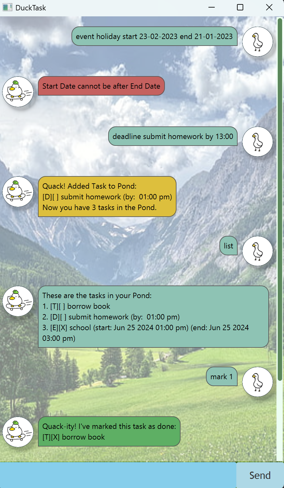

# DuckTask

DuckTask is a chatbot for managing your tasks. 
Its simple and intuitive Graphical User Interface (GUI) allows for quick management of your tasks.
Even after closing the GUI, DuckTask remembers your tasks and reloads it upon restarting the program.

- [Quick Start](#quick-start)
- [Features](#features)
  - [Show help: `help`](#show-help-help)
  - [View all tasks: `list` / `pond`](#view-all-tasks--list--pond)
  - [Mark a task as done / not done : `mark` / `unmark`](#mark-a-task-as-done--not-done--mark--unmark)
  - [Add a new Todo Task: `todo`](#add-a-new-todo-task--todo)
  - [Add a new Deadline Task: `deadline`](#add-a-new-deadline-task--deadline)
  - [Add a new Event Task: `event`](#add-a-new-event-task--event)
  - [Delete a Task: `delete`](#delete-a-task--delete)
  - [Print a motivational quote: `cheer`](#print-a-motivational-quote-cheer-)
  - [Find all tasks with a keyword: `find`](#find-all-tasks-with-a-keyword--find-)
  - [Find all tasks on or before a date: `datesearch`](#find-all-tasks-on-or-before-a-date-datesearch)
  - [Close the program: `bye`](#close-the-program-bye)
- [Command Summary](#command-summary-)
- [Response Colours](#response-colours-)

***

## Quick Start
1. Ensure you have Java `21` installed on your computer. 
2. Download the JAR File [here](https://github.com/cheranlee/ip/releases/tag/A-Release)
3. Move the JAR File to an empty folder. 
4. Run the JAR File by double-clicking on the `DuckTask.jar` file.
   Alternatively, in your command terminal, after navigating into the folder you put the JAR file in, run `java -jar "DuckTask.jar"`.
5. A GUI should appear. Type the command in the light blue box at the bottom and press Enter or click `Send` to input a user command.
6. The following sample has been populated with some user input: 

## Features

### Show help: `help`

Format: `help` 

Prints link to user guide. Shows summary of all commands.

&nbsp;

### View all tasks : `list` / `pond`

Shows a numbered list of all tasks. 

Format: `list` / `pond`

Tasks are sorted by (in ascending order):
- Todo, Deadline, Event 
- Date

&nbsp;

### Mark a task as done / not done : `mark` / `unmark`

Mark a task as **done** using `mark`.
Mark a task as **not done** using `unmark`.

Format: `mark INDEX` / `unmark INDEX`
- Marks the task at the specified `INDEX`, where the index number is shown using the `list` command.
- A task that is marked as done will be prefixed with `[X]`. A task that is marked as not done will be prefixed with `[ ]`.
- `INDEX` must be a positive integer 1, 2, 3, ...
- `INDEX` must be less than or equal to the size of the task list. 
- If a task is already marked as done, an error will be raised if `mark INDEX` is called again.
- If a task is already marked as not done, an error will be raised if `unmark INDEX` is called again.

Examples: 

|    Input     |          Output          | 
|:------------:|:------------------------:| 
|   `mark 3`   | `3. [T][X] Borrow Book`  |
| `unmark 2 `  | `2. [T][ ] Borrow book`  |

&nbsp;

### Add a new Todo Task : `todo`

Adds a new Todo task to the list of tasks. Todo tasks do not have an associated date or time. 

Format: `todo TASK`
- Adds a task with description `TASK`, where `TASK` is a valid text. 
In the task list, the corresponding task will be prefixed with `[T]`.
- An error will be raised if `TASK` is missing. 
- An error will be raised if `event` / `deadline` keywords are used. 

Examples: 

|        Input        |         Output          | 
|:-------------------:|:-----------------------:| 
| `todo borrow book`  | `3. [T][ ] Borrow Book` |
| `todo return book ` | `7. [T][ ] Return book` |

&nbsp;

### Add a new Deadline Task : `deadline`

Adds a new Deadline task to the list of tasks. Deadline tasks have an associated date/time/datetime. 

Format: `deadline TASK by DATETIME`
- Adds a task with description `TASK` and deadline `DATETIME`, where `DATETIME`
can be a date of format `dd-MM-yyyy`, time of format `HH:mm (24-hr clock)` or datetime of format `dd-MM-yyyy HH:mm`. 
- Accepted DateTime formats: 
  - | DateTime Format  | DateTime |       Example        |
    |:----------------:|:--------:|:--------------------:|
    |       DATE       |   `24-02-2024`   |   24 February 2024   |
    |       TIME       |      `13:00`       |     1 pm (Today)     |
    |     DATETIME     | `24-02-2024 13:00` | 24 February 2024 1pm |
- An error will be raised if `by` keyword is missing. 
- An error will be raised if `start` / `end` keywords are used. 
- An error will be raised if `DATETIME` is not in the above accepted formats. 

Examples:

|                Input                 |                      Output                      | 
|:------------------------------------:|:------------------------------------------------:| 
| `deadline return book by 24-02-2024` |     `3. [D][ ] return book (by: Feb 24 2024)`     |
| `deadline submit homework by 14:00`  |    `7. [D][ ] submit homework (by: 14:00 pm)`    |
| `deadline submit form by 24-02-2024 14:00`|`9. [D][ ] submit form (by: Feb 24 2024 02:00pm)` |

&nbsp;

### Add a new Event Task : `event`

Adds a new Event task to the list of tasks. Event tasks have an 
associated start date/time/datetime and end date/time/datetime. 

Format: `event TASK start DATETIME end DATETIME`
- Adds a task with description `TASK`, which will start at `DATETIME` and end at `DATETIME`.
- An error will be raised if `start` or `end` keywords are missing. 
- An error will be raised if `by` keyword is used. 
- An error will be raised if `DATETIME` is not in the above accepted formats. 
- An error will be raised if `end` datetime is before `start` datetime. 
- An error will be raised if `start` datetime is equal to `end` datetime. Time information should be given in this case.
- If date and time is given for `start` but only time is given for `end`, it is assumed that end has the same date (and vice versa). 

Examples:

|                       Input                        |                                    Output                                     | 
|:--------------------------------------------------:|:-----------------------------------------------------------------------------:| 
|   `event school start 24-02-2024 end 25-02-2024`   |          `3. [E][ ] school (start: Feb 24 2024) (end: Feb 25 2024)`           |
|     `event fundraising start 13:00 end 15:00`      |           `7. [E][ ] fundraising (start: 01:00 pm) (end: 03:00pm)`            |
| `event book fair start 24-02-2024 14:00 end 15:00` | `9. [E][ ] book fair (start: Feb 24 2024 02:00pm) (end: Feb 24 2024 03:00pm)` |

&nbsp;

### Delete a Task : `delete`

Deletes a task from the list of tasks. 

Format: `delete INDEX`
- Deletes the task at the specified `INDEX`, where the index number is shown using the  list` command. 
- `INDEX` must be a positive integer 1, 2, 3, ... 
- `INDEX` must be less than or equal to the size of the task list.

Examples: 

|    Input    |             Output              | 
|:-----------:|:-------------------------------:| 
| `delete 3`  | removes `3. [T][X] Borrow Book` |

&nbsp;

### Print a motivational quote: `cheer` 

Prints a random motivational quote. 

Format: `cheer`

Examples: 

|  Input  |           Output            | 
|:-------:|:---------------------------:| 
| `cheer` | `All good things take time!` |

&nbsp;

### Find all tasks with a keyword : `find` 

Finds and prints all tasks with a specified keyword. 

Format: `find KEYWORD` 
- Prints all tasks with `KEYWORD` in its description.
- Returns an error if there are no tasks with `KEYWORD` in its description.

Example: `find homework` , `find book`

&nbsp;

### Find all tasks on or before a date: `datesearch`

Finds and prints all tasks that fall on and before a specified **date**.

Format: `datesearch DATE`
- Only accepts a DATE. Returns an error if TIME or DATETIME is given. 

Example: `datesearch 24-01-2023` , `datesearch 06-05-2023`

&nbsp;

### Close the program: `bye`

Prints a bye message before closing the program.

Format: `bye` 

*** 

## Command Summary 

| Action | Command Format                           | 
|:------:|:-----------------------------------------| 
|Help| `help` | 
|  List  | `list` / `pond`                          |
| Mark | `mark INDEX` / `unmark INDEX`            | 
|Todo | `todo TASK`                              | 
|Deadline | `deadline TASK by DATETIME`              |
|Event| `event TASK start DATETIME end DATETIME` | 
|Delete| `delete INDEX`| 
|Cheer| `cheer`| 
|Find| `find KEYWORD`| 
|Search by Date| `datesearch DATE`| 
|Close| `bye`|

*** 

## Response Colours 

Depending on the command, the colour of the response dialog box of DuckTask would change. 

| Colour | Response Type                                         | 
|:------:|:------------------------------------------------------| 
| Yellow | A task is added. `todo`, `deadline`, `event`          | 
| Green  | A task is marked as done / not done. `mark` , `unmark |
| Brown  | A task is deleted. `delete`                           | 
| Red    | When an error is raised.                              |
